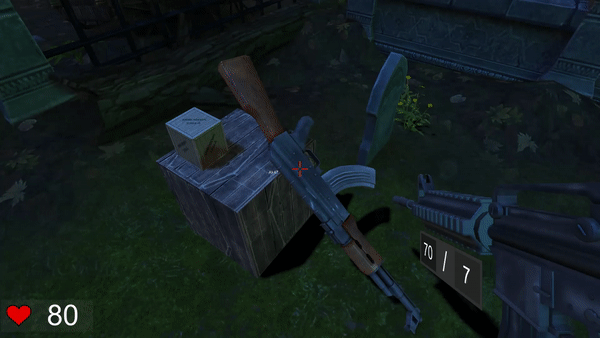

# Zombie-Cause
Zombie cause is a First person Shooter game build with unity3D engine.

Zombies are attacking the graveyard and you're stuck between these zombies and have to survive. Luckly you have interactive weapons in your inventory which might help you in surviving among zombies. Your inventory has AK47, AR and the fun thing to notice is that you can interact with wooden boxes in the enviornment by picking them up and aiming them at zombies, which hurt the zombies slightly.

# Gameplay:

# Inventory

# Main menu

Tools: Unity3D, blender  
